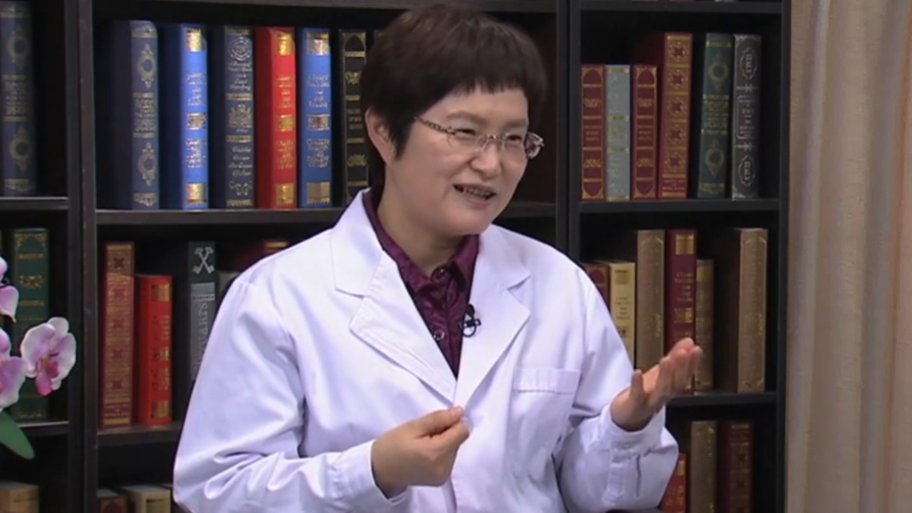

# 24.2 健康饮食 科学减肥

---

## 何丽 研究员

中国疾控中心营养与健康所科技处处长 硕士研究生导师。

中华医学会科学普及分会指导委员会专家；中国老年学和老年医学学会骨质疏松委员会副主任委员兼营养专业委员会主任委员；中国女医师协会健康教育分会副主任委员兼营养分会副主任委员；中华预防医学会健康传播分会常务委员；全民健康素养巡讲特聘国家级专家。

**主要成就：** 2013年获得中华预防医学会科技奖三等奖；曾主持和参加国内、外20多项重大科研课题的研究工作，在国内医学界率先开展了“L-阿拉伯糖对动物和人体血糖、血脂及肠道健康的影响”研究，近年发表科研论文30多篇；参与了10多本学术著作的编写，发表科普文章数百篇。

**专业特长：** 善于运用各类传播手段，广泛地为民众普及权威科学营养知识，提升大众营养素养，引导积极向上的营养健康风尚。首创“平衡膳食每天十个拳头原则”，在全国各地开设大型健康讲座1000多场，在中央电视台各栏目和各省卫视录制健康类电视节目500多集。

---
