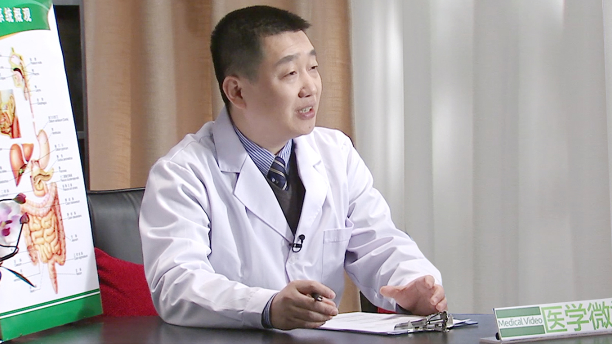

# 24.3 加速康复外科

---

## 江志伟 主任医师

南京军区南京总医院全军普通外科研究所 副所长。

**主要社会兼职：** 中国医师协会机器人外科医师委员会 副主任委员；中国研究型医院学会机器人与腹腔镜专业委员会 副主任委员；中华肠外肠内营养学分会肿瘤营养学组 组长；全军腹腔镜与机器人外科学组 副组长；首届黎介寿医学基金奖获得者；《结直肠切除应用加速康复外科中国专家共识》执笔人。

**主要成就：** 入选江苏省333高层次人才培养计划；南京军区334拔尖人才培养计划；获得国家科技进步一等奖1项；以第一负责人获得军队医疗成果二等奖2项，江苏卫生厅新技术引进一、二等奖各1项；主持江苏省重大疾病专项基金《胃癌加速康复外科规范化研究》 。

**主要论文著述：** 发表论文100余篇，有3篇论文获中华外科学会中青年优秀论文一等奖；另有4篇论文同时入选科技部“领跑者5000”项目；3篇论文入选《欧洲普通外科机器人手术专家共识》；在国际上率先开展了胃癌加速康复外科的研究，研究论文入选《欧洲胃切除加速康复外科专家共识与指南》 。

---
