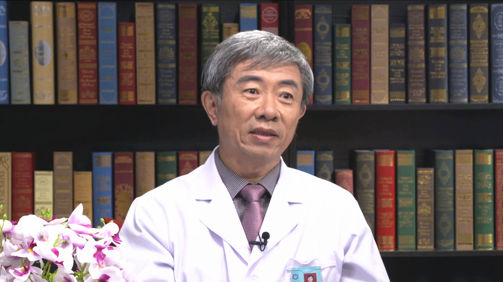

# 24.4 颈腰痛常见问题

---

## 赵平 主任医师

空军军医大学空军特色医学中心正骨治疗科主任 主任医师 硕士生导师 博士后工作站指导导师。

“新医正骨”创始人冯天有教授第一位研究生；国家中医药管理局脊柱软伤专病中心主任；世界中医药学会联合会脊柱健康委员会顾问；中华中医药学会推拿委员会顾问；北京中医药学会推拿委员会名誉主委。

**主要成就：** 荣获个人三等功1次，领导科室获得集体三等功1次；2011年被中华中医药学会评为“全国优秀整脊推拿人才”；2016年被中央保健委员会授予“中央保健工作先进个人”称号；2017年被中华中医药学会评为全国“最美中医”；主持国家863计划、北京首发基金中医重点支持、军队临床高新技术等课题10余项；曾获全军科技进步奖5项（含一等奖1项），国家发明专利4项，实用新型专利3项；发表专著6部，参编著作5部；在国内外专业期刊上发表中英文论文80余篇。

**专业特长：** 擅长脊柱疾病的诊治，治疗脊柱疾病精准有效，对手法治疗脊柱损伤退变性疾病的机制做过较为深入和系统的临床试验研究。

---
