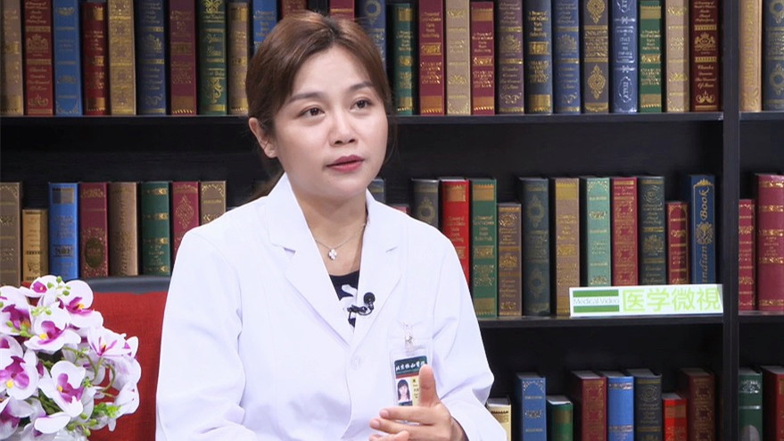

# 24.5 肌少症（肌肉减少症）

---

## 康琳 副主任医师

北京协和医院老年医学科副主任 副主任医师；北京协和医学院老年医学系副主任。

中华医学会老年医学分会第十届青年委员会副主任委员；中华医学会老年医学分会老年营养不良与肌少症工作组秘书长；北京医师协会老年医学专科医师分会常务理事兼总干事。

**主要成就：** 致力于衰弱、肌少症的临床研究及老年慢性疾病的防治、老年综合评估技术的推广，承担并参与多项科技部、北京市科委临床科研项目及协和医学院教学项目。

**专业特长：** 擅长衰弱和肌少症等老年综合征、老年综合评估及老年心血管病，如老年高血压、房颤、心衰、高脂血症、冠心病等疾病的临床与科研工作。

---
