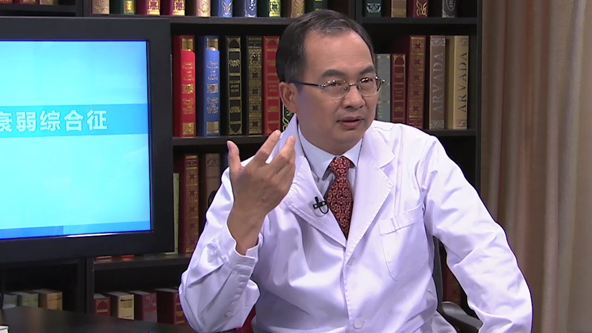

# 24.7 老年人衰弱与跌倒的防护

---

## 于普林 研究员

中华医学会老年医学分会第九届主任委员；卫生计生委老年医学研究所研究员 副所长。

北京医院期刊编辑部副主任；中华医学会北京分会老年专业委会常务委员；《中华老年医学杂志》副总编辑；《中华流行病学杂志》编委。

**主要成就：** 承担了国家自然科学基金国际合作项目、WHO课题、“九五”课题等多项国家级科研项目及国际科研合作项目，先后培养了十多名研究生，在专业杂志发表论文100余篇，主编《老年医学》、《老年流行病学》等专著。2006年帕金森病、痴呆的临床、流行病学和病因研究获2006年中华医学科技奖壹等奖；2012年度获“全国优秀科技工作者”称号。

**专业特长：** 研究领域主要涉及常见老年疾病的现状和特点、老年卫生保健服务模式、老年人生活质量调查内容及判定标准、社区老年人跌倒、老年人衰弱指数研究等，擅长以上领域的相关疾病。

---
