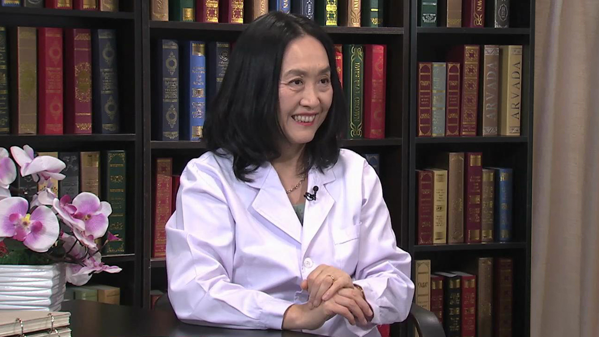

# 24.8 慢病防治营养管理

---

## 李兆萍 主任医师

UCLA（洛杉矶加州大学）人类营养中心主任 ；UCLA （洛杉矶加州大学）里根医学中心临床营养科主任。

美国临床营养医师协会副主委 侯任主委；世界华人临床营养医师协会主委；美国营养协会理事；美国营养学会医学营养分会理事；琳达和斯朵特.瑞斯奈克人类营养冠名讲席教授；北京协和医院客座教授；美国《营养综述》（Nutrition Reviews）编委；美国《营养综述年刊》（Annual Review of Nutrition）编委；《传统和替补医学杂志》（Journal of Traditional and Complementary Medicine）编委 。

**主要成就：** 担任过50多个营养，肥胖，肿瘤，肠道菌群和植物营养研究项目的首席研究员；先后在《美国医学学会杂志》(JAMA),《美国内科杂志》(Annals Internal Medicine),《美国营养杂志 》(Journal of Nutrition),《美国临床营养杂志 》(Am. J. Clinical Nutrition) 等权威杂志发表论文一百五十余篇。

**专业特长：** 是美国为数不多的临床营养专科医生和营养科学研究者。拥有在美国一流医学院/医学中心二十多年的医学实践，教学和科研经验。在临床营养领域成就卓越。多次应邀在美国、加拿大、英国、新加坡、韩国、新西兰、中国大陆和台湾的营养大会做专题报告。

---
