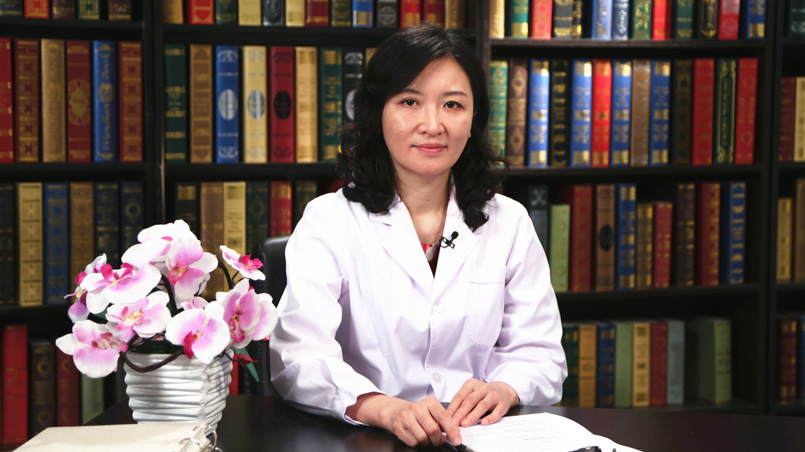

# 24.9 慢性疼痛

---

## 赵晶 主任医师

中日友好医院手术麻醉科主任 手术委员会主任 外科教研部副主任 主任医师 博士生导师。

中国医学科学院协和学者特聘教授；宾夕法尼亚大学医院联合副教授；北京医师协会疼痛专科医师分会副会长；北京医学会麻醉学分会副主任委员；中国医师协会麻醉学分会常委。

**主要成就：** 发表学术论文70余篇；先后承担国家自然科学基金、首都医学发展科研基金项目、协和学者特聘教授科研基金项目等多项课题。

**专业特长：** 主要研究方向为围术期过敏反应、疼痛与认知功能障碍，麻醉对免疫功能的影响等。擅长疑难重症患者的麻醉、危重病人的急救、慢性疼痛的诊治。

---
