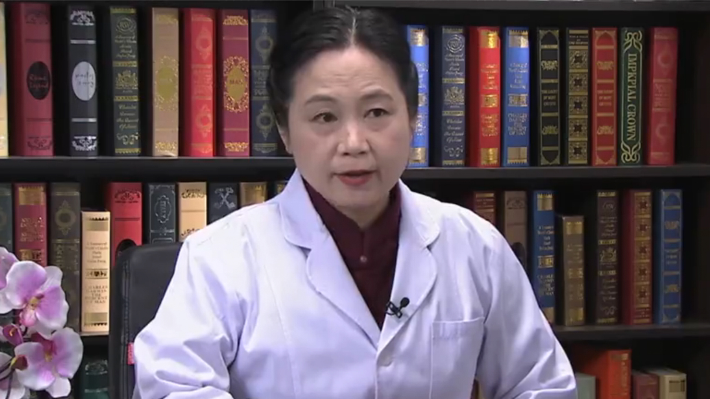

# 24.17 认知障碍康复

---

## 谢欲晓 主任医师

中日友好医院康复医学科主任 主任医师。

全国康复科学首席传播专家；中华医学会物理医学与康复专委会常委兼心肺学组组长；中国康复医学会常委理事兼副秘书长 远程康复专委会主委 康复教育专委会常委；中国医师协会康复医学专委会常委；中国老年医学会康复分会副会长；中国女医师协会常务理事兼康复专委会主委；中国转化医学康复技术学会常委兼语言康复专委会副主委；中华中医药学会养生康复分会常委兼副秘书长；北京康复医学会骨科分会副会长；北京市专科医师考试专业委员会副主委。

**主要成就：** 承担国家科技支撑计划九五、十五、十一五、十二五课题、北京市科委重大项目3项、世界健康基金会慢性病管理项目子项目等；在《Stroke》《Optical Engineering》《Journal of Rehabilitation Medicine》《Clinical Rehabilitation》《中华物理医学与康复杂志》《中国康复医学杂志》《中国康复理论与实践》等医学期刊发表论著70余篇；曾被评为北京医学会先进个人、北京市全国残疾人社区康复示范区培育工作先进个人、中日友好医院优秀教师等。

**专业特长：** 从事康复医学临床工作35年，擅长神经康复、神经心理康复、呼吸康复及骨科康复，研究方向为神经心理与康复、ICF在康复临床应用等。

---
