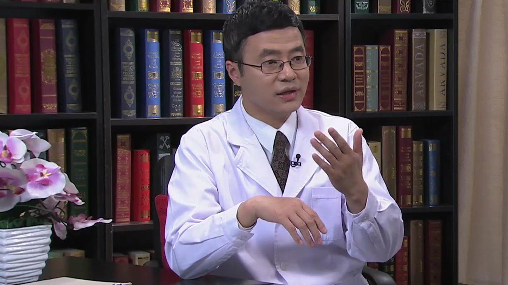

# 24.19 医学减重

---

## 陈伟 主任医师

中国医学科学院北京协和医院临床营养科副主任 主任医师 硕士生导师。

中华医学会肠外肠内营养学分会老年学组副组长；中国医师协会营养医师专业委员会副主任委员；中国营养学会临床营养分会副主任委员；中国医疗保健国际交流促进会营养与代谢管理分会主任委员；中华医学会糖尿病学分会教育管理学组委员；胃肠激素与营养协作组副组长；中青年委员会副主任委员。

**主要成就：** 参加国家多项课题研究工作，获得省级科技奖3项；发表学术论文57篇，SCI收录11篇；撰写科普书籍17部。

**专业特长：** 致力于临床患者的各种类型的营养不良防治工作，从人工营养支持的适应证把握、支持途径的建立与选择、营养支持的实施全过程以及终末期营养支持的缓和医学工作。在行业内编写基于循证医学的临床指南和专家共识多部，掌握国际前沿的技术。在国内率先开发营养诊断体系、牵头进行家庭肠外肠内营养支持的教育和培训工作。

---
