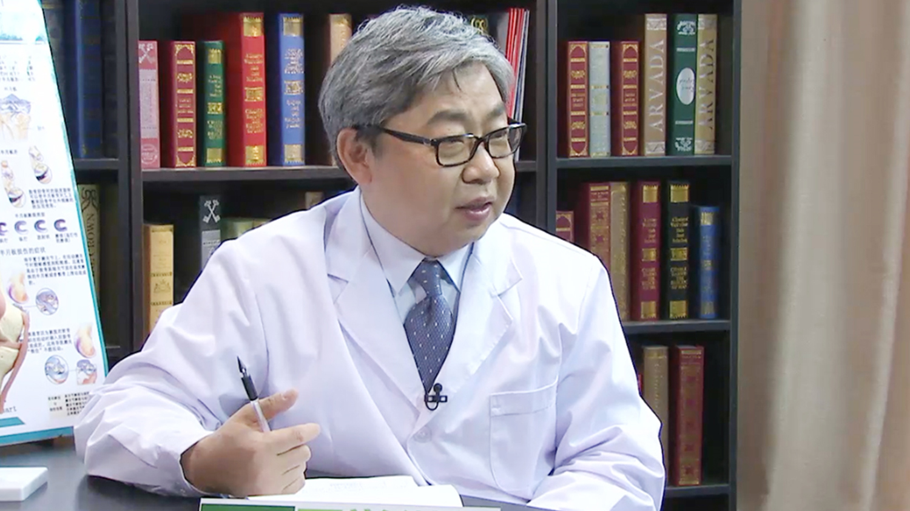

# 24.20 运动创伤康复

---

## 周谋望 主任医师

北京大学第三医院 北京大学国际医院康复医学科主任 主任医师。

北京大学康复医学与理疗学博士点负责人 博士生导师；中华医学会物理医学与康复委员会常委；中国医师协会康复医师分会候任会长兼肌肉骨骼专委会主委；中国康复医学会副会长；中国康复医学会运动疗法专业委员会主委；中国医促会康复医学分会主委；中国康复医学杂志副主编。

**主要成就：** 2012年被中国科协授予“全国优秀科技工作者”荣誉称号；主持国家自然基金4项；在国内外发表论文85篇；主编及编写专著教材共计35部。

**专业特长：** 擅长骨科康复；运动损伤康复；脊髓损伤康复及膀胱功能重建、骨质疏松症治疗及疼痛治疗。

---
