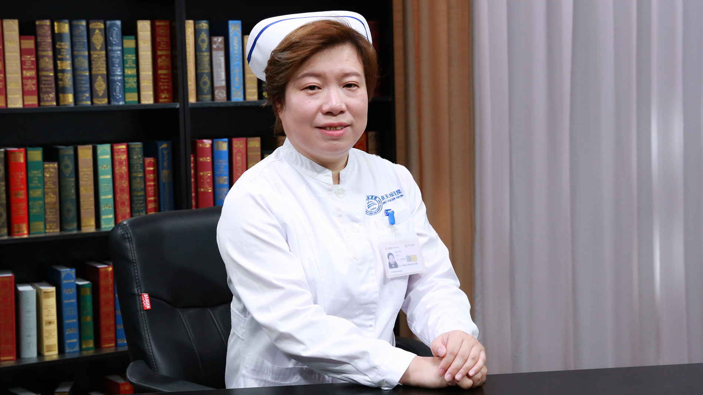

# 25.1 阿尔茨海默病患者的护理

---

## 李璇 主管护师

首都医科大学附属北京天坛医院认知障碍科护士长 主管护师。

国际伤口治疗师；中国老年学和老年医学学会脑认知与健康分会委员。

**主要成就：** 从事脑血管疾病及神经重症临床护理及教学20年，参与伤口护理质控2年；2017年进入北京积水潭医院伤口治疗师学校学习，获得国际伤口治疗师学会颁发的“国际伤口治疗师”证书；担任北京天坛医院伤口质量控制小组的成员，负责神经内科疑难复杂伤口的会诊、处置与临床指导，参与伤口门诊的出诊工作。

**专业特长：** 擅长神经内科压力性损伤、慢性伤口的治疗。

---
