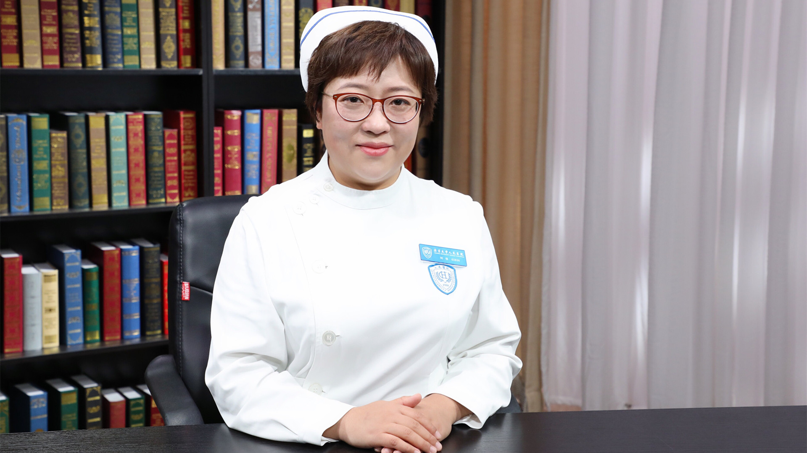

# 25.2 白内障手术护理

---

## 刘佳 副主任护师

北京大学人民医院眼科中心护士长。

北京护理学会眼科分会秘书；首都卫生发展科研专项评审专家；美国眼科护士协会ARGON会员；美国老年病协会AGS会员；中国战略型人才库入库人员。

**专业特长：** 发表国家核心期刊论著16篇；人民卫生出版社《五官科专科护理技术操作规范》副主编；参与编著全国高等教育自学考试指定教材《急救护理学》；获得北大护理英才计划成果奖三等奖；多次参与国内及国际医疗援助及健康快车扶贫项目；曾经担任中华医学会全国眼科护士长培训授课老师；参与历年眼科质量与安全PPP学术会议护理风险部分的研讨。

**专业特长：** 擅长眼科专业疾病护理、眼科专业护士的培养与发展规划、眼科疑难疾病风险管理、眼科专科技术操作及流程的构建。

---
