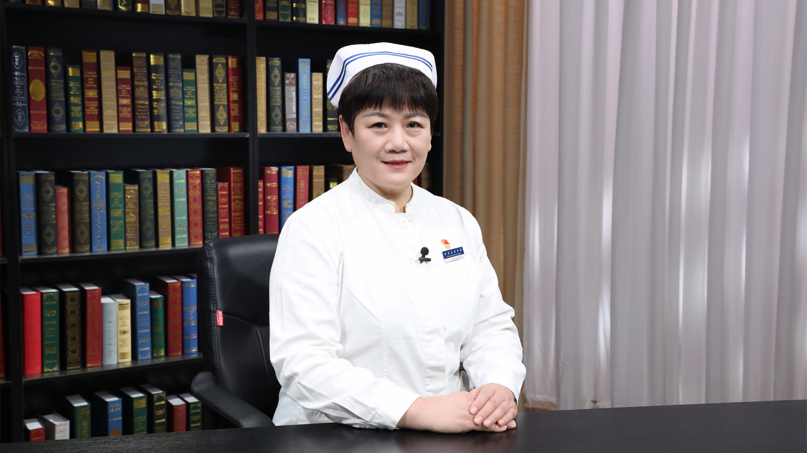

# 25.3 剖宫产术后护理

---

## 杨捷 副主任护师

首都医科大学附属北京友谊医院妇产科科护士长。

中华护理学会产科专业委员会委员；北京护理学会妇产科专业委员会副主任委员；中西医结合护理专业委员会委员；中国医药教育协会妇科专业委员会委员；中国妇幼保健协会助产适宜技术学组委员；北京妇产学会妇幼健康教育分会委员。

**主要成就：** 核心期刊发表论文10余篇，参编《助产士规范化培训》《北京市属医院护士规范化培训指南》《妇产科护理》书籍10余部。

**专业特长：** 擅长围产期母婴护理，孕期营养、孕期保健，产时管理、母乳喂养咨询，产后康复、新生儿护理。

---
