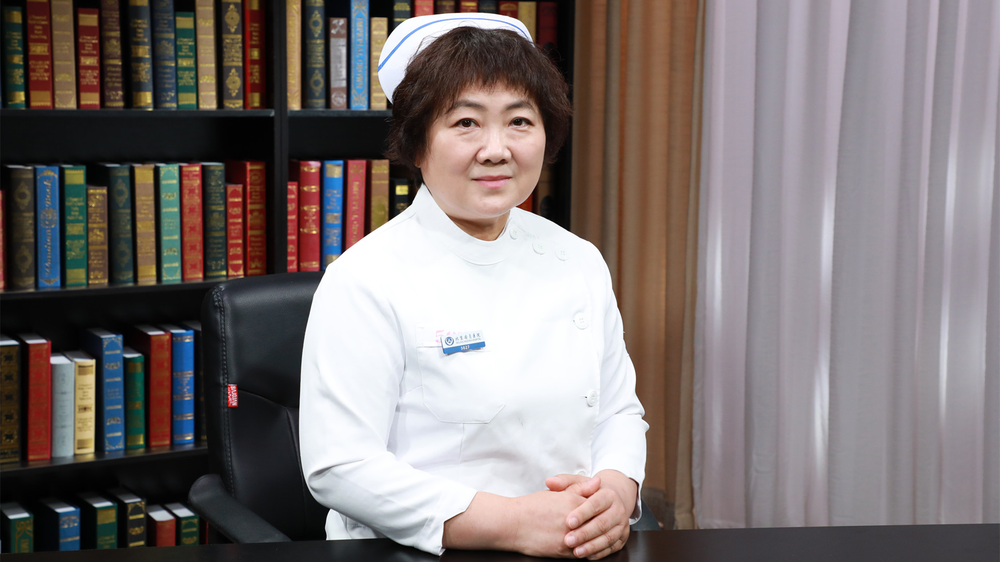

# 25.16 冠心病的日常护理

---

## 张立新 副主任护师

首都医科大学附属北京安贞医院急诊危重症中心护士长 副主任护师.

冠心病学科交叉暨介入治疗大会护理峰会秘书长；首届北京护理学会急诊专科护士资格认证获得者。

**主要成就** ：参与编译《2013ACC/ESC心血管病研究进展》一书；先后发表论文5篇，其中中华系列杂志两篇；参与“国家国际科技合作专项”课题、《睡眠呼吸暂停与重大心血管病的关联与干预》课题、“北京安贞医院院长基金护理专项”课题、RIGHT-2临床研究以及首都医科大学护理学院心血管护理课题病例收集等多项课题研究.

**专业特长：** 擅长临床急救。从事临床工作30年，积累了大量的急危重症及心血管患者护理和管理经验。

---
