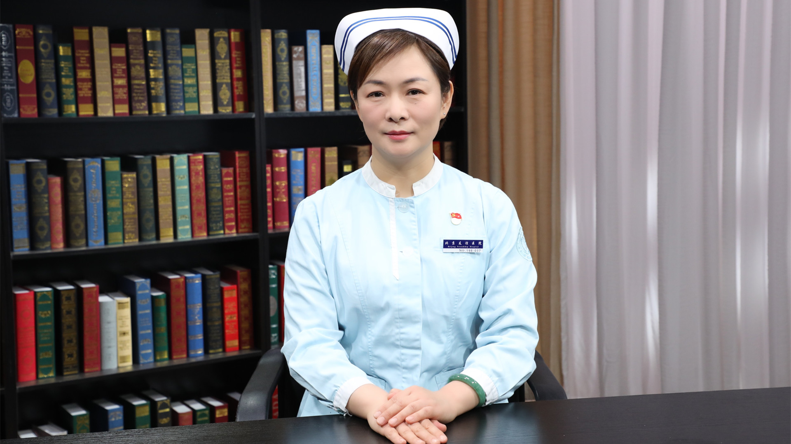

# 25.18 ICU谵妄护理

---

## 金艳鸿 副主任护师

首都医科大学附属北京友谊医院重症医学科护士长 护理学硕士。

中华护理学会重症护理专业委员会专家库成员；北京护理学会重症监护专业委员会副主任委员；中西医结合学会急救医学专业委员会委员。

**主要成就：** 承担院级课题1项，参与市级及国家级课题数项；参编书籍5部；已发表核心期刊10余篇。

**专业特长：** 从事重症监护10余年，擅长各种重症监护技术及护理管理。

---
