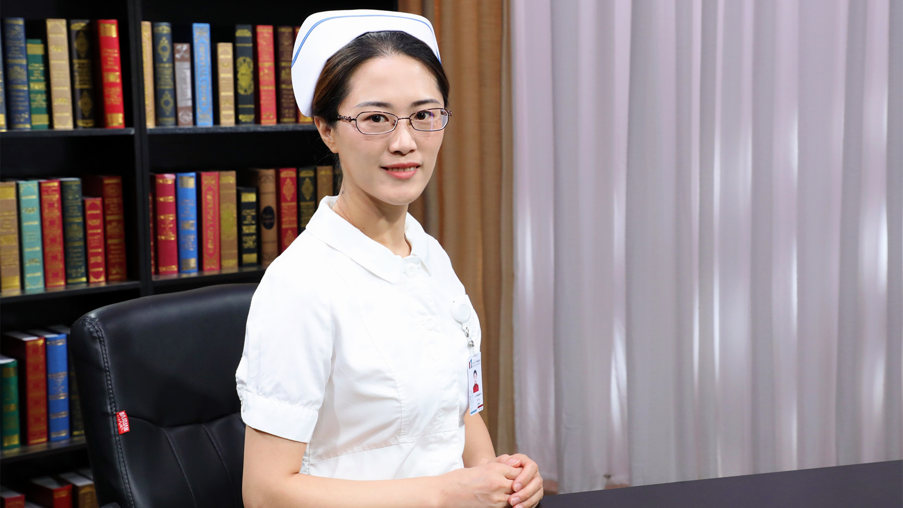

# 25.19 静脉导管的护理

---

## 沈艳芬 主管护师

北京大学肿瘤医院ICU静脉通路中心护士长。

中华护理学会静脉治疗专业委员会委员；北京护理学会静脉治疗专业委员会委员；中国抗癌协会肿瘤重症医学专业委员会护理学组委员会委员；北京大学肿瘤医院静疗组核心成员。

**主要成就：** 发表核心论文8篇，参编书籍2本。

**专业擅长：** 擅长静脉输液治疗和中心静脉导管的应用。

---
