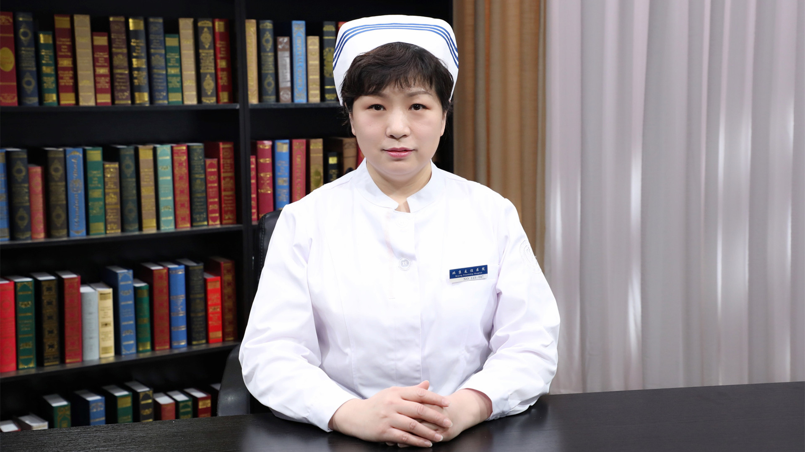

# 25.25 阑尾炎的术后护理

---

## 孙萌 副主任护师

首都医科大学附属北京友谊医院护理部副主任。

首都医科大学第二临床医学院护理学系副主任；中华护理学会第27届理事会宣传工作委员会委员；中国研究型医院学会护理分会人工智能与信息化护理学组委员；中国抗癌协会肿瘤营养与支持治疗专业委员会护理营养学组成员；中国医学装备协会护理装备与材料分会委员。

**主要成就：** 发表核心期刊论文10余篇；承担院级课题1项，参与局级课题多项。

**专业特长：** 擅长乳腺外科、甲状腺外科、胃肠外科、肝胆外科以及移植外科的护理及管理。

---
