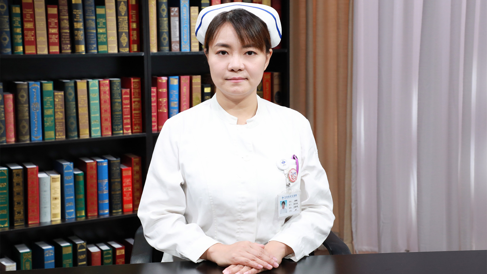

# 25.27 淋巴水肿护理

---

## 王婷婷 主管护师

首都医科大学附属北京世纪坛医院淋巴外科护士长。

中国医师协会腔内血管学专业委员会淋巴疾病专家委员会委员。

**主要成就：** 2016年参与首都卫生发展科研专项项目《联合应用吸脂减容术与淋巴静脉吻合术治疗肢体淋巴水肿的临床研究》；2018年参与扬帆计划、北京市自然科学基金《乳腺癌术后患者上肢淋巴水肿多学科专业团队全程管理干预模式的研究》工作；2018年参加院内科研基金课题《继发性下肢淋巴水肿患者自我管理状况及其需求分析》课题。

**专业特长：** 擅长原发性、继发性淋巴水肿，乳糜反流性疾病的护理。

---
