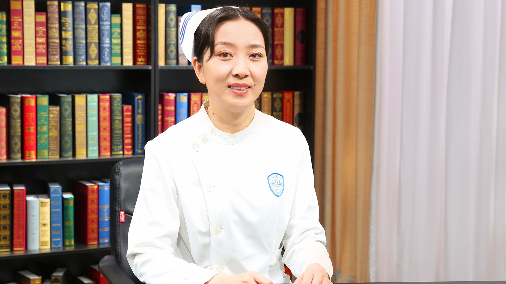

# 25.31 失禁相关性皮炎的护理

---

## 王泠 主任护师

北京大学人民医院护理部主任 主任护师 硕士生导师。

中华护理学会造口 伤口 失禁护理专业委员会主任委员 ；中华护理学会常务理事 ；中国医学装备协会创面修复分会副会长 ；北京护理学会伤口 造口 失禁护理专业委员会主任委员；北京医学会创面修复分会副主任委员 ；《中华护理杂志》编委。

**主要成就：** 在核心期刊发表论文30余篇，主编书籍10余部；致力于造口、慢性伤口、失禁护理，护理信息化建设与护理管理等方面的研究；获得中华护理学会科技奖三等奖，北京市青年学术演讲比赛一等奖等奖项。

**专业特长：** 擅长造口护理、失禁护理以及皮肤窦道和复杂伤口的处理，同时为此类患者提供心理护理、康复护理，尤其对肠造口、压力性损伤和失禁相关性皮炎的护理有深入研究。

---
