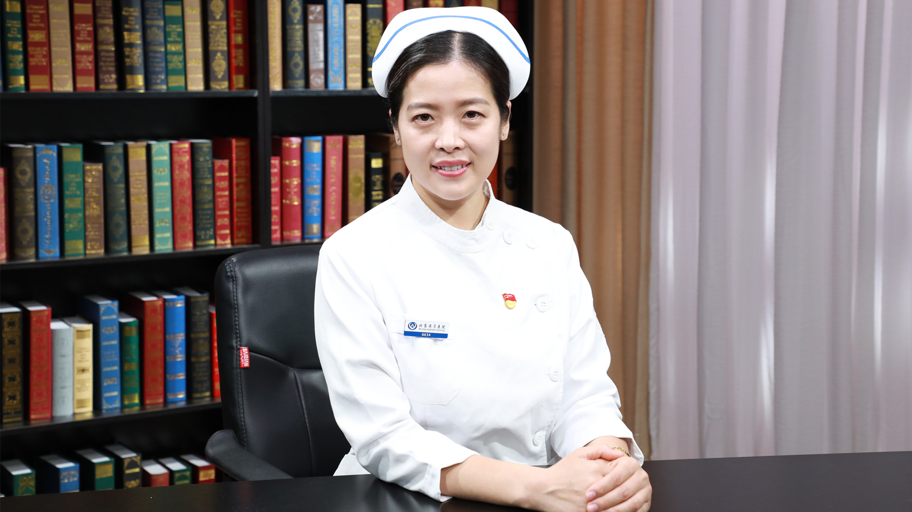

# 25.33 糖尿病患者的饮食护理

---

## 文丽娜 副主任护师

康教育护理师；中华护理学会第二十七届理事会糖尿病护理专业委员会专家库成员。

北京护理学会第十一届内分泌专业委员会委员；北京糖尿病防治协会教育专员；《中国临床护理》杂志编委。

**主要成就：** 核心期刊发表论文10余篇，参与多项临床科研工作，致力于内分泌代谢学及相关学科临床护理、护理管理及糖尿病健康教育工作。

**专业特长** ：擅长内分泌代谢学科及相关学科临床护理、护理管理，尤其是对糖尿病健康教育有深入研究。

---
