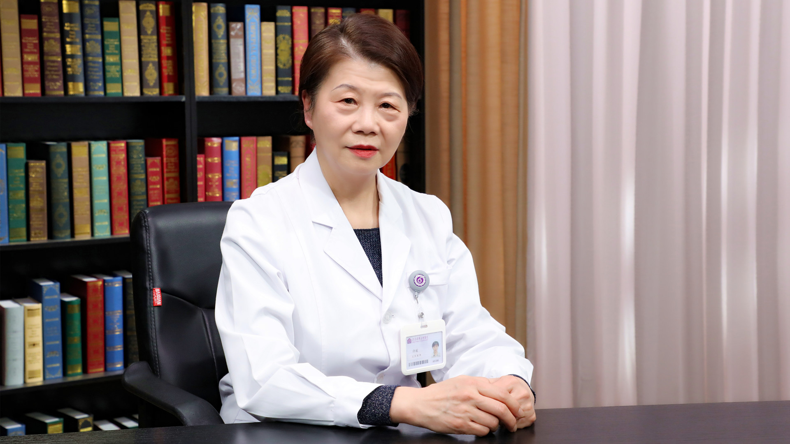

# 25.36 危重症患者的营养支持

---

## 许媛 主任医师

清华大学附属北京清华长庚医院重症医学科主任医师 教授 中华医学会重症医学分会常务委员。

中华医学会肠外肠内营养学分会常务委员；中国医师协会重症医学医师分会副会长；北京医学会重症医学分会副主任委员。

**主要成就：** 担任《中华危重病急救医学杂志》《中华危重症医学电子期刊》《肠外与肠内营养》编委；《中华临床营养杂志》《中国呼吸与危重监护杂志》《亚太临床营养杂志》*Critical care medicine、Critical Care、America Journal of clinical nutrition *中文版编委；《中华外科杂志》《中华内科杂志》《中华医学杂志》中、英文版审稿专家。

**专业特长：** 擅长危重病医学，在重症营养治疗与代谢调理，重症创伤与外科，胃肠功能障碍等方面有更深入的探讨。

---
