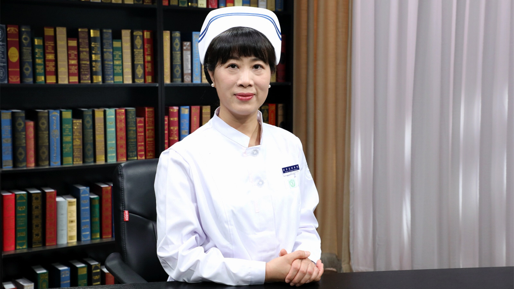

# 25.44 腰椎间盘突出症手术前后护理

---

## 易祖玲 副主任护师

首都医科大学附属北京友谊医院骨科护士长。

北京护理学会第十一届骨科专业委员会副主任委员；中国老年学和老年医学学会骨质疏松分会护理专业委员会副主任委员；中国健康促进基金会骨病专项基金骨科护理专家委员会委员；中华护理学会第二十七届理事会骨科护理专业委员会委员；首都医科大学骨外科学系第一届护理专业委员会组长。

**主要成就：** 承担院级课题一项；曾先后发表护理文章近二十篇；主编书籍《骨科护理》《骨科疾病社区护理与自我管理》，副主编书籍1本，参编书籍4本；2001年11月在香港伊丽沙伯医院进修，2009年5月在香港威尔斯亲王医院矫形外科进修，2011年4月在英国国王大学南丁格尔护理学院进修。

**专业特长：** 擅长骨科护理及管理，负责首都医科大学附属北京友谊医院护理部培训教学专项工作。

---
