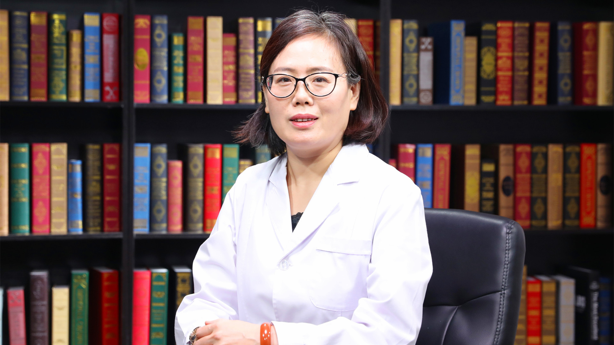

# 26.17 安眠药的合理使用

---

## 司天梅 研究员/教授

北京大学第六医院副院长 临床精神药理研究室主任 博士生导师。

中华医学会精神病学分会常务委员；中国医师协会精神科医师分会常务委员；中国神经科学学会精神病学基础与临床专业委员会常务委员；亚洲精神分裂症研究协会主席。

**主要成就：** 主持国家科技部重大新药创制项目、国家自然科学基金重点项目、面上项目和青年基金委项目、北京市科委和首发基金联合攻关项目；发表SCI论文百余篇，累计影响因子300余分。

**专业特长：** 精神药理学与临床精神药物治疗学，致力于情感障碍诊断和治疗的客观标记物研究、精神药物疗效及不良反应相关研究，擅长情感障碍、精神分裂症等精神疾病的药物治疗。

---
