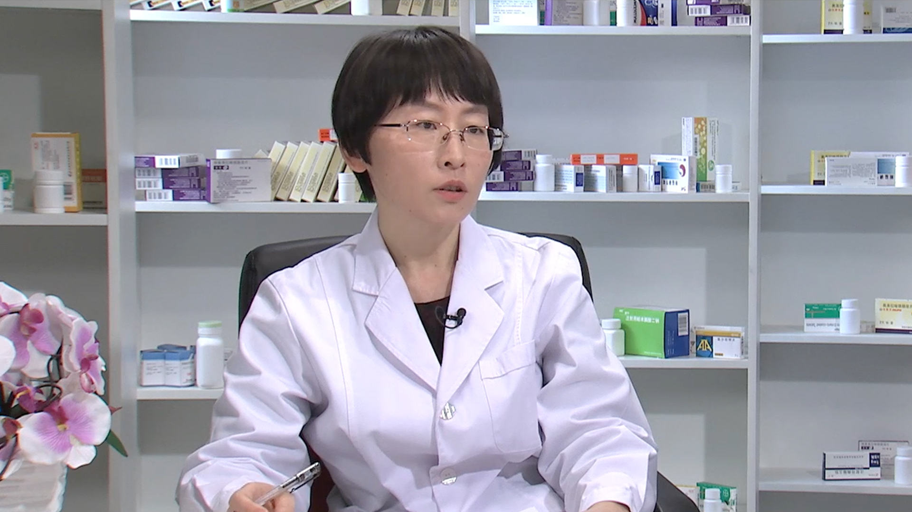

# 26.20 阿奇霉素

---

## 朱曼副 主任药师

中国人民解放军总医院药学部临床药学中心副主任药师。

抗感染专业临床药师 医学硕士；中国研究型医院学会药物评价专业委员会常务委员；中国医药教育协会临床合理用药专业委员会委员 ；中国药理学会化疗药理专业委员会委员 ；北京医学会临床药学分会委员；北京药理学会抗感染药理专业委员会委员；《中国药物应用与监测》杂志编委；《中国药物评价》杂志编委；《临床药物治疗学杂志》青年编委。

**主要成就：** 2011年入选中国药学会首批青年临床药师赴美培训；2012年获中国医院药学青年优秀药师奖、全军药品不良反应监测先进工作者；2015年荣获中华医学会临床药学分会优秀临床药师；以第一作者在统计源期刊发表论著50余篇，SCI论文4篇，参编专著18部（主编1部，副主编7部）。

**专业特长：** 从事临床药学工作多年，积极开展围绕合理用药工作的住院医嘱审核、合理用药咨询、用药教育、药学会诊等临床药学服务工作。作为卫计委抗感染专业的临床药师学员和师资学员带教师资，擅长和专注于抗感染药物的合理使用。

---
