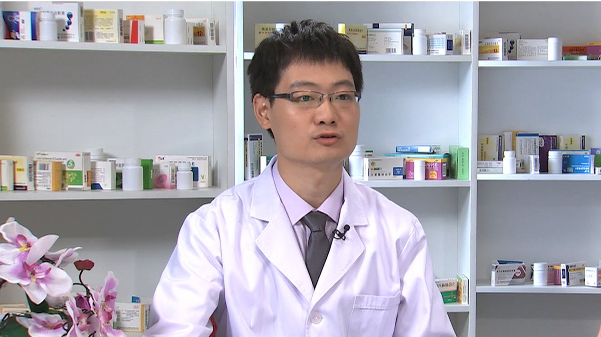

# 26.22 阿瑞匹坦胶囊

---

## 刘敬弢 副主任药师

北京大学肿瘤医院药剂科副主任药师　北京大学药学博士。

中国研究型医院学会药物经济学专业委员会委员；中国老年学和老年医学学会肿瘤康复分会用药安全工作委员会委员；北京药师协会治疗药物监测药师分会委员；北京药师协会药物经济学专业委员会委员；北京抗癌药物专业委员会青年委员。

**主要成就：** 作为一名临床药师，同时在临床合理用药和基础药物研发领域开展工作；目前已发表学术论文多篇，参与课题研究多项，并多次参加学术会议交流及药学科普活动。

**专业特长：** 擅长抗肿瘤及其辅助药物的临床合理应用及临床前实验研究；尤其对逆转肿瘤复发的作用机制与新药研发，抗肿瘤药物的联合应用与血药浓度监测、肿瘤患者慢性基础病的药学监护均有较为深入的研究。

---
