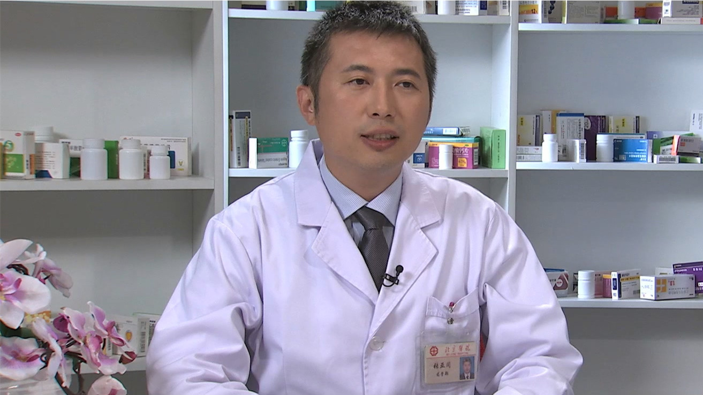

# 26.25 阿托伐他汀片（阿托伐他汀钙片）

---

## 张亚同 副主任药师

北京医院药学部副主任药师 美国MTM认证药师 临床药师师资 硕士生导师。

中国医药教育协会合理用药分会常务委员；中华医学会心电生理和起搏学分会专业学组委员；中国药理协会TDM协会青年委员；北京药学会教育委员会委员；《药物不良反应杂志》青年编委；《临床药物治疗杂志》青年编委。

**主要成就：** 发表论文80余篇，主编或参编书籍12项；参与十三五重大项目、自然基金项目5项，主持局级项目、重大项目子课题3项，成果获得局级奖励三次。

**专业特长：** 先后在呼吸科、心内科、肾内科及血液科从事临床合理用药工作，现在从事心内科临床药学工作；关注老年合理用药和安全工作，擅长老年心血管用药和抗血栓用药的调整和治疗。

---
