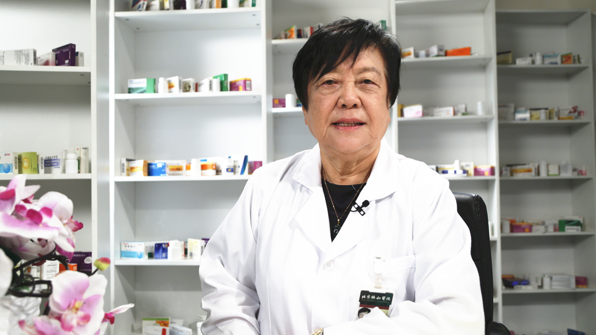

# 26.26 百姓用药常见误区

---

## 张继春 主任药师

北京协和医院药剂科主任药师；中国药学会科技开发中心特聘顾问。

全国医院药学 药事管理 药学科普学科首席科学传播专家；国家执业药师资格考试命审题专家；中国科学技术出版社科技/科普专家；北京药盾公益基金会-专家委员会委员。

**主要成就：** 退休后十年在药学会参与完成九个部委委托的十一五、十二五课题30余项；通过讲课、电视、网络等进行继续教育和科普讲座120余场，遍及30余个省（市）；参与执业药师考试大纲和试题审定及考试指南的编写，出版书籍《临床用药须知》《用药有道》《家庭合理用药问答》等50余本，发表文章40余篇。

**专业特长：** 从事调剂、制剂及药事管理兼协和卫校药理教课近10年，建立各项规章制度及操作规程，不断改进药房的硬件设备，严格贯彻各项政策法规，较好地保证医教研的中西药品及试剂的供应，做好药事委员会工作，严把进药关口，制定了一系列购药程序。

---
