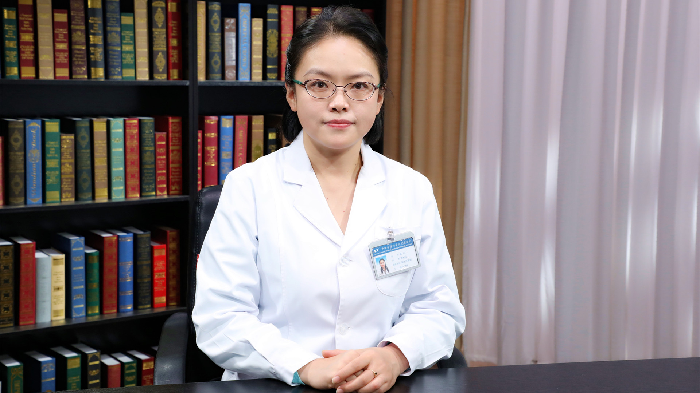

# 26.28 贝伐单抗

---

## 杨珺 副主任药师

中国医学科学院肿瘤医院药剂科副主任药师。

中国抗癌协会肿瘤临床药学专业委员会青年委员会委员 ；中国药理学会治疗药物监测研究专业委员会青年委员会委员 ；中国医药教育协会肿瘤化学治疗专业委员会委员。

**主要成就：** 公开发表论文38篇；主持、参与科研项目12项；获得国家专利1项，3类新药1项。

**专业特长：** 擅长肿瘤专科临床药学监护。先后在乳腺内科、妇科肿瘤、放疗科、肺部肿瘤病区担任临床药师。

---
