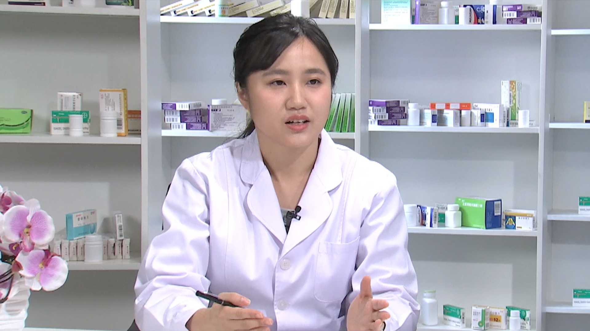

# 26.30 别嘌醇

---

## 陈頔 副主任药师

北京医院药学部副主任药师。

中华医学会临床药学分会优秀临床药师；北京药理学会神经精神药理学专业委员会青年委员；北京药学会“临床药学之星”；国家临床药师培训带教师资；美国MTM药师。

**主要成就：** 主持北京市科学技术委员会首都特色基金1项，北京医院课题2项；参与国家科技支撑计划课题、国家科技重大新药创制项目、卫生部行业基金项目、中国药学会、北京药学会等多项科研课题；发表论文20余篇，参编学术专著6部。

**专业特长：** 擅长心脑血管疾病、高尿酸血症、糖尿病、高脂血症等慢性疾病的药物治疗，尤其对神经系统疾病的治疗有比较深入的研究。

---
