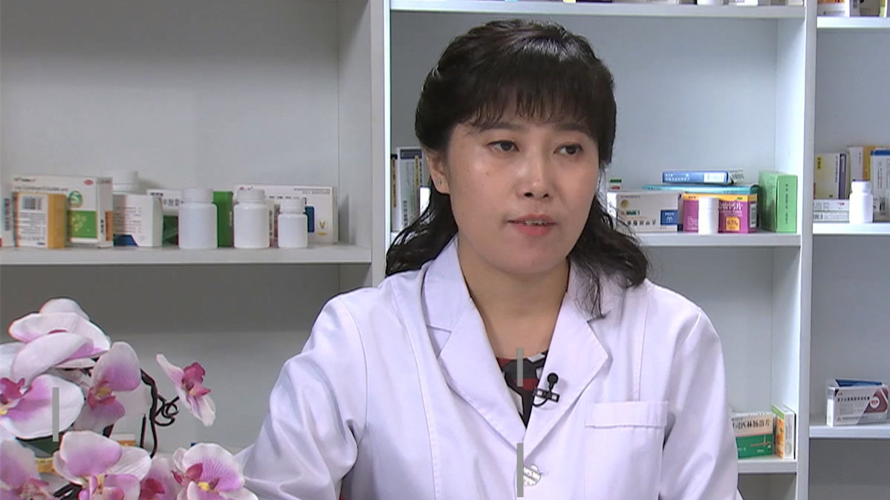

# 26.36 布洛芬

---

## 安卓玲 主任药师

首都医科大学附属北京朝阳医院药事部副主任 主任药师 博士后。

首都医科大学第三临床医学院临床药理教研室副主任；北京药师协会药学服务与技术国际交流专委会副主任委员；北京中医药学会临床合理用药评价专业委员会常务委员；北京市中西医结合学会药学专业委员会委员；中国女医师协会药学专业委员会委员。

**主要成就：** 发表SCI文章5篇，中文核心9篇；2012年获北京药理学会青年论坛论文报告三等奖；2015年获中国药学会施维雅青年医院药学奖；近五年获得国家自然科学基金2项、北京市自然科学基金面上项目1项、中国博士后基金1项，入选2015年医管局青苗人才培养项目，2016年北京朝阳医院1351人才培养项目（朝阳新星），北京市医院管理局2018年度市属医院科研培育计划管理类课题1项。

**专业特长：** 擅长医院药事管理、临床药理学和药代动力学、体内药物分析、代谢组学在疾病的临床应用、质谱分析技术的临床应用研究。

---
