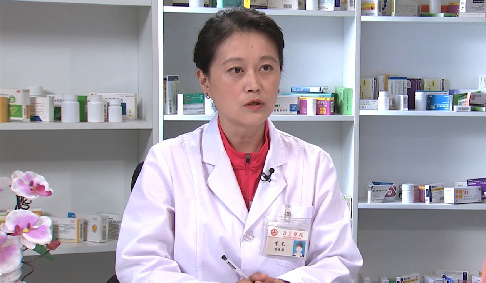

# 26.45 地屈孕酮

---

## 李艺 副主任药师

北京医院药学部妇产科临床药师。

药品安全合作联盟（PSM）北京医院药学代表；《药物与人》杂志特约撰稿人。

**主要成就：** 参与国家科技支撑计划项目1项、北京医院院级课题1项；参与撰写：《吸入制剂临床药学监护手册》《临床药物治疗学丛书：老年性疾病》《心脏病药物治疗学》《药用对了才治病》；参与编译：《药学监护实践方法》；近期以第一作者发表论文7篇，其中3篇SCI论文。

**专业特长：** 熟悉抗感染治疗及内分泌科、心血管内科、呼吸内科、神经内科等专科用药，擅长妇产科用药，尤其对妊娠期、哺乳期妇女和儿童的安全合理用药、多囊卵巢综合征的药物治疗、月经不调和围绝经期综合征用药有深入的研究。

---
