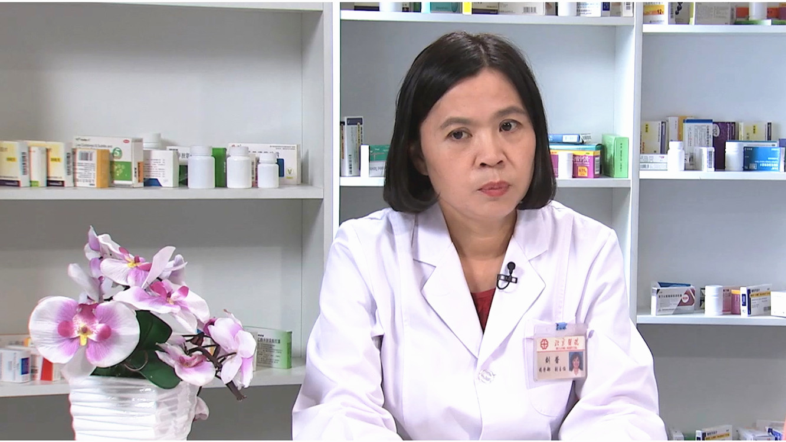

# 26.46 对乙酰氨基酚//刘蕾教授

---

## 刘蕾 主任药师

北京医院药学部副主任 主任药师 硕士生导师。

中华中医药学会医院药学分会第六届委员会委员；中华中医药学会治未病分会第一届委员会委员；北京中医药学会第一届中药人才培养工作委员会委员；北京药师协会第三届药品使用专业委员会委员。

**主要成就：** 在核心期刊发表研究论著60余篇；参与《马丁代尔药物大典》的翻译工作；参与国家级课题4级，在国内会议征文比赛中多次获奖。

**专业特长：** 曾负责并参与多项I期临床研究、体内药物分析、药代动力学方面的研究；在临床药学方面，擅长药物的合理应用监测、干预与评价，负责药品的遴选及评价，药品物流管理工作。

---
