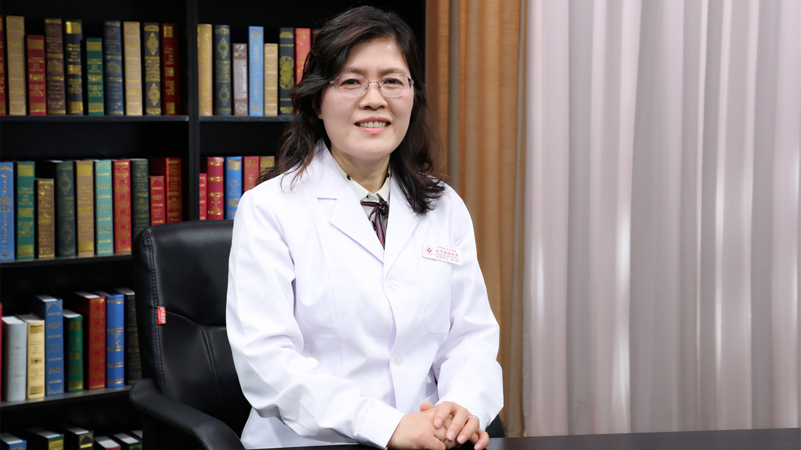

# 26.59 复方甲氧那明胶囊

---

## 邱葵 副主任药师

首都医科大学附属北京朝阳医院副主任药师 执业药师 药理学硕士。

美国MTM认证药师 现负责中草药房的管理；首都医科大学《临床药理学》授课教师；北京中医药学会药事管理委员会委员；北京中医药学会中成药委员会委员。

**主要成就：** 发表中英文论著30余篇；致力于中西药联合应用有效性和安全性研究；参与药物基因组学编写；参与北京市科学技术委员会国际合作项目、首都中医药与护理研究专项课题、I期药物临床试验等课题研究。

**专业特长：** 擅长脑血管病中西药物治疗，老年患者中西药物治疗及管理。

---
