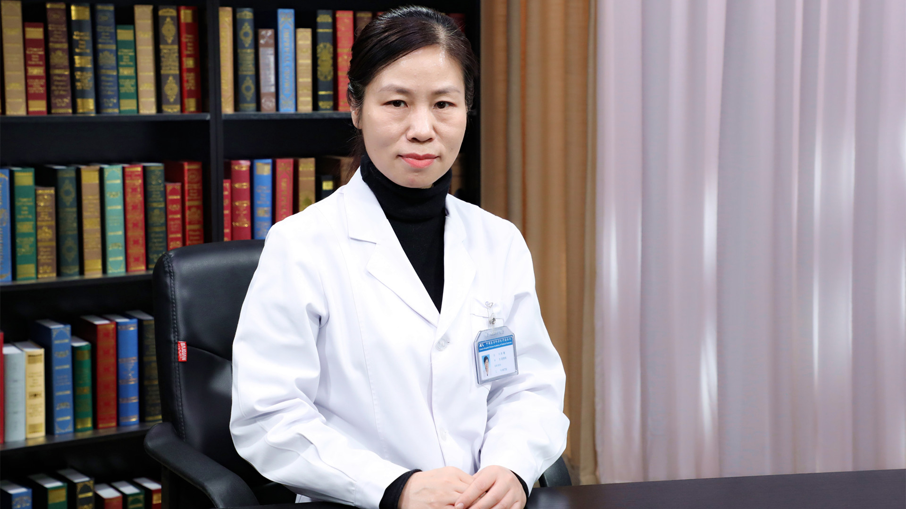

# 26.66 戈舍瑞林

---

## 刘敏 副主任药师

中国医学科学院肿瘤医院药剂科临床药师。

中国医药教育协会临床合理用药专业委员会常务委员；中国医药教育协会临床抗肿瘤用药评价分会委员；中国抗癌协会肿瘤临床药学专业委员会委员；北京药学会肿瘤药学专业委员会秘书；《药物不良反应杂志》青年编委。

**主要成就：** 以第一作者发表SCI及统计源期刊论文30余篇，参编7部专著、副主编1部；以第一完成人及主要研究者承担国家“十二五”科技支撑计划项目子课题2项，承担和参与院所课题8项，完成新技术新业务1项；作为主要研究者获北京市科技进步二等奖1项，获专利3项。

**专业特长：** 擅长抗感染、高血压、糖尿病及泌尿系统肿瘤的药物治疗。

---
