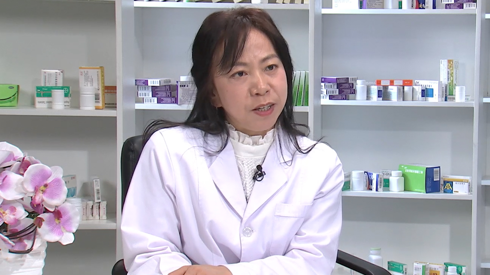

# 26.68 鲑降钙素

---

## 杜广清 主任药师

首都医科大学附属北京康复医院康复药学中心主任。

首都医科大学副教授；中国康复医疗机构联盟康复药学专委会主任委员；国家科学技术奖励评审专家；医疗机构高警示药品管理专业委员会副主任委员；第三届中华医学科技奖评审委员会委员；中国医药报刊协会用药安全信息专业委员会常务委员；教育部国家科学技术奖励评审专家；首届国家执业药师工作专家库专家。

**主要成就：** 在药学专业核心期刊及医药卫生报刊发表临床药学和药事管理及法学相关的学术论文及研究四十余篇；主编临床药师案头工作手册丛书《戒烟治疗临床药师指导手册》；参编医改论著《政府与社会资本合作改造公立医院的模式研究》及药学书籍如《药品超说明书使用循证评价》《得了肩周炎怎么办》等。

**专业特长：** 主要从事医院制剂管理、康复临床药学方向、药物经济学及药事管理法学相关领域的研究，重点研究特殊人群的合理用药、患者的科普用药教育，研究呼吸科、心内科、老年内科及抗感染的全程个体化药物治疗。

---
