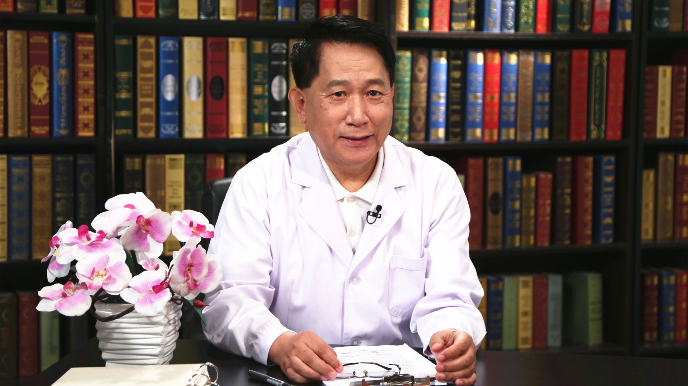

# 26.72 华法林的安全应用

---

## 张石革 主任药师

北京积水潭医院主任药师；国家食品药品监督管理总局执业药师资格认证中心专家。

国家食品药品监督管理总局药师培训专家；国家卫生健康委员会科技教育司培训专家；《中国国家处方集》编委会核心组专家；《中国医院用药评价与分析》杂志副主编；《中国药房》杂志资深编委；《中国全科医学》 《中国合理用药探索》 《中国医药导刊》 《中国现代医药杂志》等杂志常务编委。

**主要成就：** 曾先后发表医药学术论文442篇，主编专著（第一主编）34部；先后获得国家科技进步二等奖1项，北京市、天津市科技成果奖和科技进步奖7项；1987-1990年赴法国学习，2008年赴英国考察。

**专业特长：** 新药研发与评价、药物治疗（慢病治疗与用药监护）和临床药学。

---
