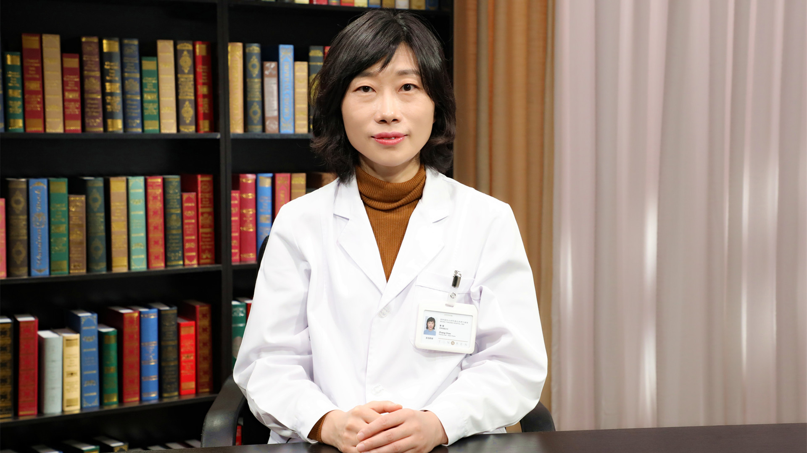

# 26.86 看懂药品说明书

---

## 张弨 主任药师

首都医科大学附属北京同仁医院药学部主任 硕士研究生导师。

中国药理学会定量药理学专业委员会委员；中国女医师协会药学专业委员会委员；中国心胸血管麻醉学会心血管药学分会常务委员；亚洲临床药学理事会理事；国际FERCAP伦理认证中国区审评专家。

**主要成就：** 主持和参与国家自然科学基金、国家高科技863计划、北京大学985项目等多项课题基金；以第一作者或通讯作者发表国际和国内学术论文70余篇；负责3个SCI和8个核心期刊杂志审稿。

**专业特长：** 擅长疑难患者用药方案的制定和优化，主要研究方向是临床药学、临床药理学、药物评价研究。

---
