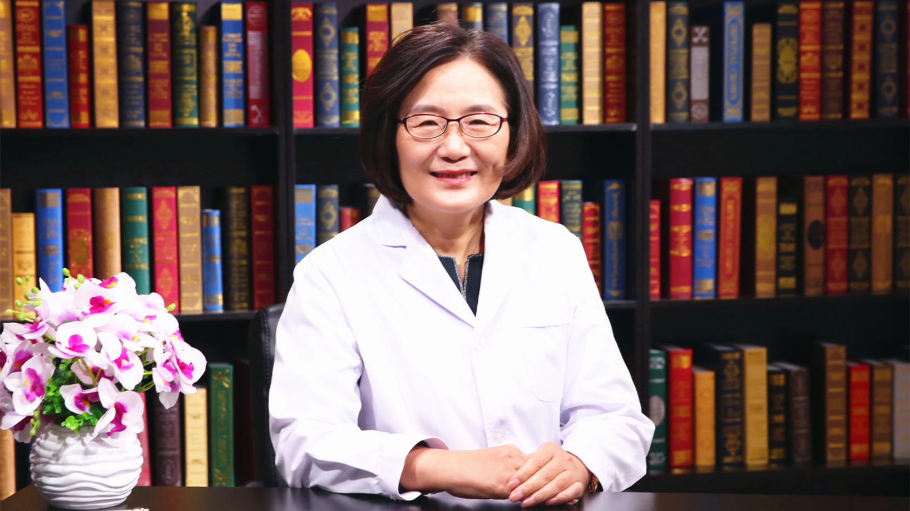

# 26.90 抗肿瘤新药临床试验//沈琳教授

---

## 沈琳 主任医师

北京大学肿瘤医院副院长 消化肿瘤内科及I期临床研究中心主任 主任医师 博士生导师。

中国抗癌协会肿瘤药物临床研究专业委员会主任委员；中国医师协会外科医师分会MDT专业委员会主任委员；中国抗癌协会胃癌专业委员会秘书长；中国抗癌协会大肠癌专业委员会副主任委员；CSCO（中国临床肿瘤学会）胃癌专业委员会候任主任委员。

**主要成就：** 获国家科技进步二等奖、教育部科技进步一等奖、中华医学科技一等奖、华夏医学科技一等奖、中国抗癌协会科技一等奖等奖项；2016年被评为全国优秀科技工作者；是我国胃肠道肿瘤多学科综合治疗（MDT）的发起人、倡导者和推广者。

**专业特长：** 擅长消化系统肿瘤的诊断与治疗，特别是胃肠道肿瘤的综合治疗与个体化治疗。

---
