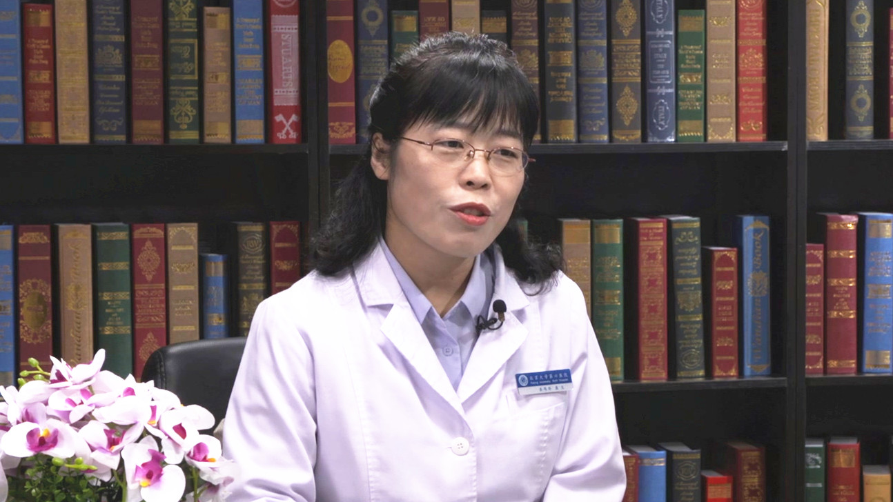

# 26.92 抗抑郁药的合理应用

---

## 岳伟华 研究员

北京大学第六医院(精神卫生研究所)主管科研副院(所)长。

国家精神心理疾病临床医学研究中心(北京大学第六医院)副主任  博士研究生导师；中国神经科学学会理事；中国神经科学学会精神病学基础与临床分会委员。

**主要成就：** 国家杰出青年科学基金及优秀青年科学基金获得者；入选教育部新世纪优秀人才及北京市科技新星计划；获教育部自然科学二等奖；发表SCI收录论文90余篇，代表性论著发表在Nature Genetics、Lancet Psychiatry、Molecular Psychiatry等杂志；承担国家自然科学基金、国家重点研发计划、国家863计划等科研项目。

**专业特长：** 擅长精神分裂症、抑郁症等常见精神疾病的诊断与治疗。

---
