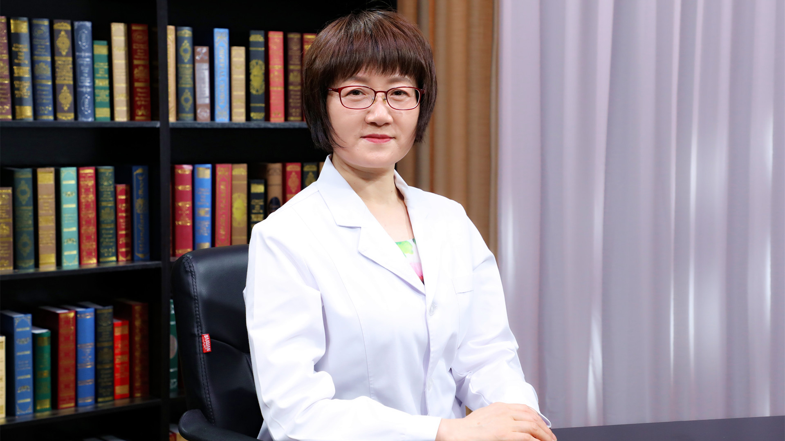

# 26.93 抗肿瘤靶向治疗药物的合理应用

---

## 李国辉 主任药师

中国医学科学院肿瘤医院药剂科主任 主任药师 硕士研究生导师。

中国抗癌协会肿瘤临床药学专业委员会主任委员；中国药师协会肿瘤药师分会主任委员；中国药学会药学服务专业委员会副主任委员；中华中医药学会医院药学分会副主任委员兼秘书长；北京药学会肿瘤药学专业委员会主任委员。

**主要成就：** 主编、副主编、参编《含西药成分中成药的合理使用》《肿瘤专科药师临床工作手册》等专著7部；主持国家科技支撑计划子课题、北京市科委等多项课题；以第一或通讯作者发表论文60余篇，其中SCI8篇。

**专业特长：** 长期从事医院药学及合理用药工作，在如何正确用药方面积累了丰富的经验；擅长多种药物联合使用，对药物治疗管理有独到见解。

---
