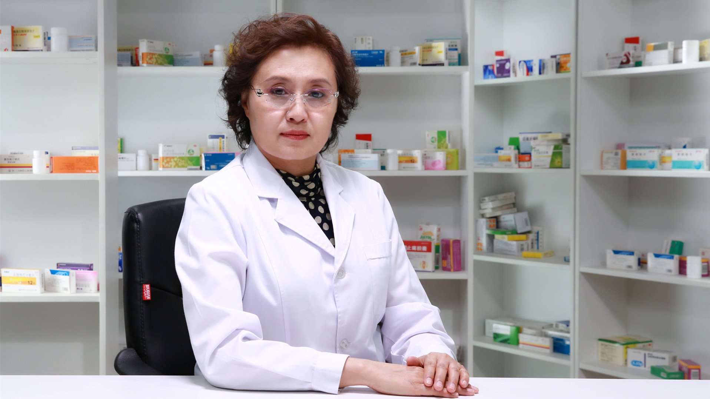

# 26.96 咳嗽药物的合理使用

---

## 闫素英 主任药师

首都医科大学宣武医院药学部副主任兼药剂科主任 主任药师 副教授 硕士生导师。

北京市医管局总药师 ；国家老年疾病临床医学研究中心全国老年药学联盟主席 ；国际血管联盟药物治疗管理专家委员会副主任委员 ；中国医药教育协会药物治疗管理培训中心副主任委员 ；北京药师协会药物治疗管理专业委员会主任委员 ；中国药学会科普工作委员会委员 ；中国药理学会治疗药物监测研究专业委员会常务委员 ；中国医院协会药事管理专业委员会委员 ；中国药学会循证药学专业委员会委员；北京药学会抗菌药物专业委员会副主任委员；北京药师协会治疗药物监测专业委员会副主任委员。

**主要成就：** 主编教材《药学服务与沟通》《药理学》《临床药理学》《护理药物治疗学》《药物治疗管理教学与实践手册》；发表第一作者/通讯作者文章60余篇；主持完成/在研10余项省部级和局级课题。

**专业特长：** 老年糖尿病等慢病药学服务、注射剂合理应用、药物利用评价、医院药事管理。

---
