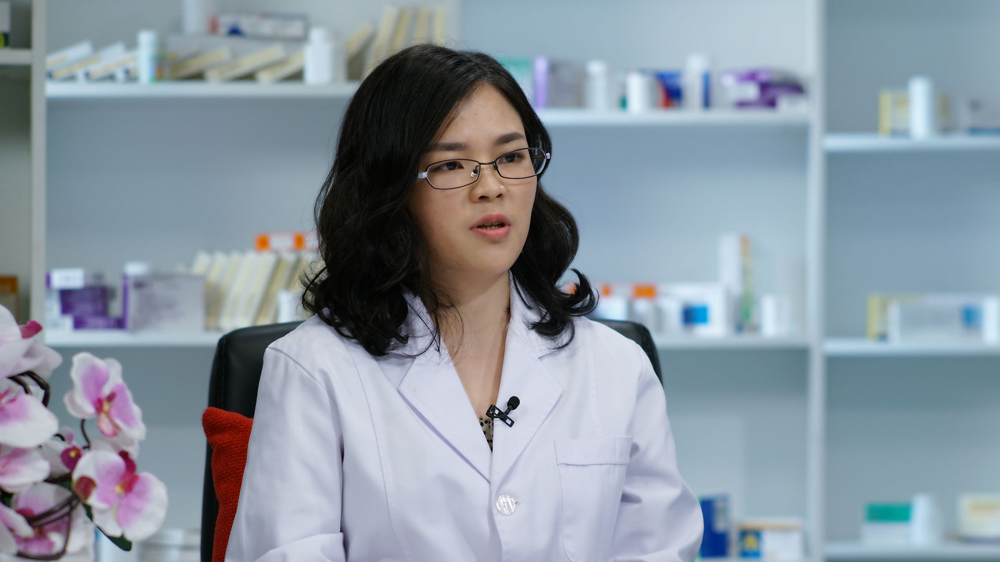

# 26.98 口服补液盐

---

## 钟旭丽 副主任药师

首都儿科研究所附属儿童医院药剂科 副主任药师 临床药学硕士。

中国医药新闻信息协会儿童安全用药分会委员；中国临床安全用药监测网联络员及院静脉用药安全管理小组成员。

**主要成就** ：作为课题负责人完成北京市药学会课题1项、所级课题2项和北京市不良反应中心牵头的多中心课题2项；发表核心期刊论文8篇，在医学报刊和北京市医管局公众号发表科普文章多篇，参与编写《儿童用药百问百答》《药，您用对了吗》《儿童保健用药咨询标准化手册》等书籍。

**专业特长：** 擅长于儿童用药的咨询和药品不良反应的研究。

---
