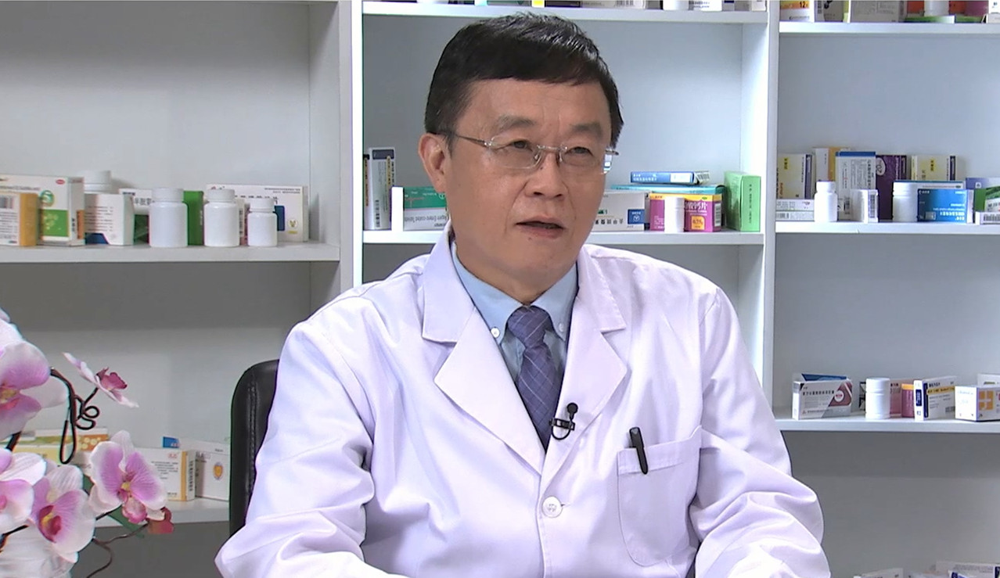

# 26.100 老年人安全用药

---

## 胡欣 主任药师

北京医院药学部主任 主任药师 博士生导师。

中国药师协会副会长；国家食品药品监督管理总局仿制药质量和疗效一致性评价专家委员会委员；卫生部合理用药专家委员会委员。

**主要成就：** 先后发表论文100余篇，主编药学书籍三部，参加编写书籍10余部；完成多项新药临床前研究，已获新药证书四个，获局级成果一等奖2项，二等奖2项，三等奖1项；承担多项卫生行业科研专项项目，国家科技重大专项课题，国家重大新药创制课题和国自然课题等国家课题多项。

**专业特长：** 从事医院药学研究和医院药事管理工作，研究方向为中、西药药动学新方法及其关键技术研究、药物相互作用动力学研究、药物临床路径研究、医院药物安全警戒研究。

---
