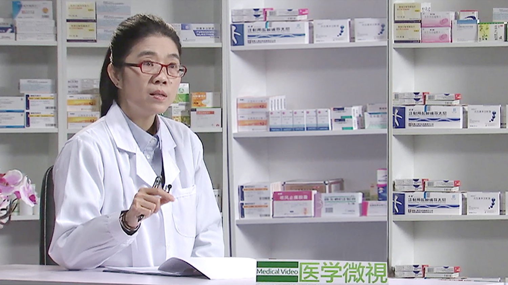

# 26.106 硫酸氯吡格雷

---

## 唐崑 教授

中日友好医院药学部临床药学科主任 肾内科临床药师。

中国医药教育协会临床合理用药专业委员会委员；北京医院协会药事管理专业委员会委员；北京药理学会生殖药理专业委员会委员；北京药师协会教育专业委员会委员；北京医学会鉴定专家。

**主要成就：** 在《中国药学杂志》《中国医院药学杂志》《中国药房》《中国药物警戒》《中国医院用药评价与分析》等专业期刊发表论著20余篇；在专科临床药学服务模式的建立、临床药学的教学、医院药师技术服务转型方面做了大量的工作和探索。

**专业特长：** 擅长药物性肾损害的判断与预防、慢性肾脏病患者合理用药等。

---
