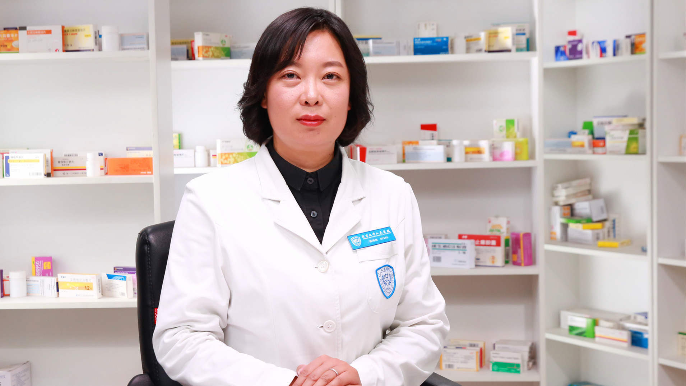

# 26.111 铝碳酸镁片

---

## 张海英 主任药师

北京大学人民医院药剂科副主任 主任药师 药学硕士。

北京药师协会药物警戒专业委员会副主任委员；北京中西医结合学会药学专业委员会常务委员；中国研究型医院学会药物评价专业委员会委员；北京药学会药剂学专业委员会委员；北京中医药学会临床合理用药评价专业委员会委员；北京药理学会合理用药与健康促进分会委员。

**主要成就：** 曾获中国医院药学青年药师优秀奖；国内核心期刊发表文章40余篇（第一及通讯作者），参编书籍9部； 获北京药学会课题3项，医院研究与发展基金3项，参与多项研究课题；2011至今连续多年主办国家级、市级继续教育项目培训班多项。

**专业特长：** 擅长呼吸专业的药物治疗，高血压患者的药物治疗及其他慢病患者的安全合理用药。

---
