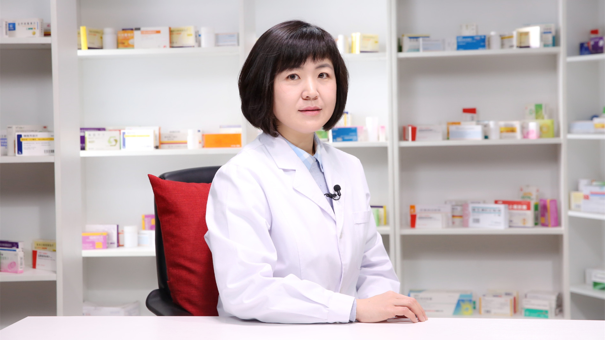

# 26.123 女性洗液

---

## 王爱华 副主任药师

首都医科大学附属北京妇产医院药事部临床药师 副主任药师。

北京药理学会精准药学专业委员会委员；美国药师协会药物治疗管理项目认证药师。

**主要成就：** 承担和参与多项课题研究，多篇文章在核心期刊上发表；曾获全国医院药学学术年会和妇产科药学大会优秀论文奖，北京药学会优秀药师称号。

**专业特长：** 擅长妇产科临床药学服务、精准药学个体化用药指导。

---
