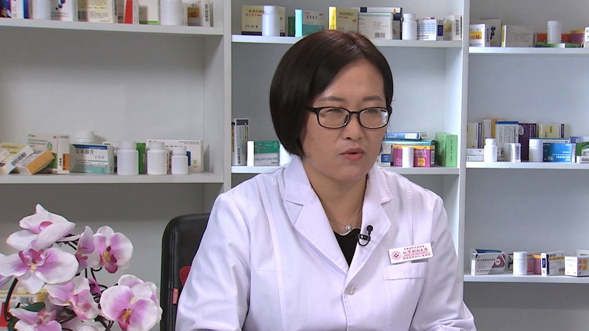

# 26.136 噻托溴铵

---

## 崔向丽 主任药师

首都医科大学附属北京朝阳医院临床药学中心组长 主任药师 博士 硕士生导师。

北京药学会理事；中国研究型医院学会药物经济学专业委员会青年委员；中国女医师协会药学专业委员会委员；北京药理学会临床药理专业委员会青年委员；北京药学会抗感染药学专业委员会青年委员；北京药学会应用与转化专业委员会委员。

**主要成就：** 先后获得中国药学会“优秀临床药师”，中华医学会临床药学分会“优秀临床药师”，北京药学会“临床药师之星”；参加国家863课题、国家自然科学基金、北京自然科学基金等；副主编3部，参编医药学著作12部；一作或通讯作者发表SCI论文8篇，核心期刊论文100余篇。

**专业特长 ：** 擅长呼吸系统用药、抗凝用药及老年患者药物治疗管理及颅脑肿瘤化疗等药物治疗。

---
