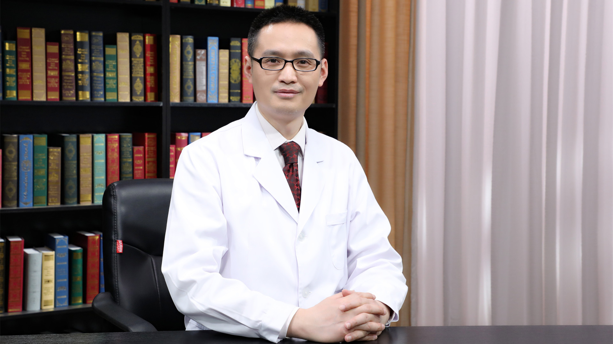

# 26.148 他达拉非片

---

## 金鹏飞 主任药师

北京医院药学部副主任 主任药师 硕士生导师。

中国药理学会治疗药物浓度监测研究专业委员会委员；中国卫生经济学会青年卫生经济委员会常务委员；中国药理学会肾脏药理专业委员会委员；北京药学会理事；《药物分析杂志》《中国药房》《北京生物医学工程》《中南药学》《中国医药导报》《临床药物治疗杂志》《中国药业》编委。

**主要成就：** 第一作者/通讯作者核心期刊发表论文150多篇，其中SCI论文10多篇；主持国家自然科学基金、北京市自然科学基金等课题4项，参加省部级以上课题6项。

**专业特长：** 主要从事医院药学相关工作，尤其擅长药品质量控制研究和药物安全性检验新技术研究。

---
