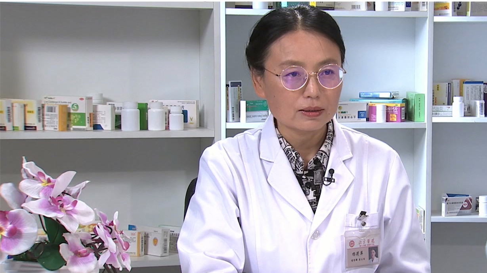

# 26.155 替加环素

---

## 杨莉萍 主任药师

北京医院药学部副主任 主任药师 药理学博士。

世界中医药学会联合会脉象研究专业委员会常务理事；中国中医药信息研究会中西医学汇通分会副会长；中华医学会呼吸病学分会烟草病学组委员；中国药理学会药物基因组学专业委员会委员；中国健康促进会临床药学个体化医学委员会副秘书长和安全专家委员会秘书长；中国药理学会治疗药物监测研究专业委员会循证药学学组委员 。

**主要成就：** 发表论文90余篇；致力中药药理、药物基因、药物不良反应的基础与临床研究；创立了北京医院药物基因实验室，建立了临床治疗药物的基因检测系统和报告系统；首次报道万古霉素引起严重药疹与基因突变的关系。

**专业特长 ：** 擅长临床合理用药、药物相互作用（包括中西药）、药物基因检测的临床应用与指导。尤其对抗菌药物、抗肿瘤药物、抗凝药物有深入的研究。

---
