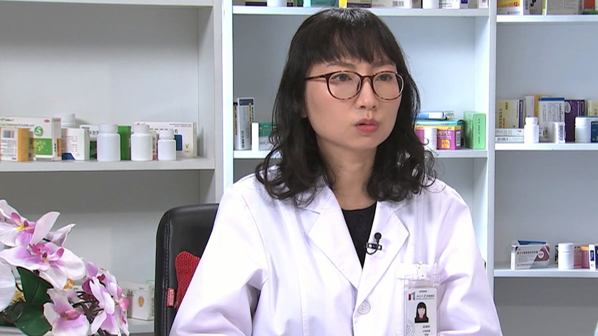

# 26.156 替吉奥胶囊

---

## 李然副 主任药师

北京大学肿瘤医院副主任药师 药学硕士。

北京药理学会抗感染药理专业委员会青年委员；国家临床药师培训基地疼痛专业带教药师；2013年度北京药学会临床药师之星。

**主要成就：** 先后取得临床药师通科、疼痛专科及带教师资岗位证书；发表学术论文数篇，参与课题研究数项。

**专业特长：** 目前主要从事消化系统肿瘤及癌痛药学相关工作，在抗肿瘤药物合理使用、肿瘤患者药学监护方面具有丰富经验；擅长结直肠癌、胃癌、胰腺癌、肝癌等消化系统肿瘤的药物治疗监护，癌痛及术后疼痛的用药和监护。

---
